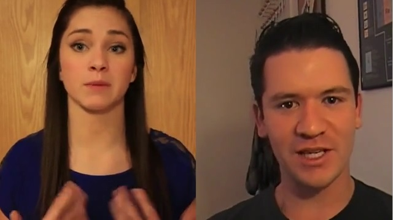
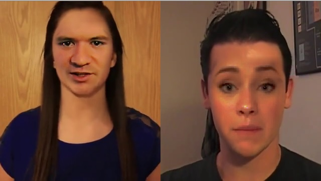

# [Youtube video](https://youtu.be/32i1ca8pcTg)

# How to run?

OpenCV and dlib are required.

Copy haarcascade_frontalface_default.xml from OpenCV sources/data/haarcascades folder.
Download shape_predictor_68_face_landmarks.dat from http://sourceforge.net/projects/dclib/files/dlib/v18.10/shape_predictor_68_face_landmarks.dat.bz2 and place in correct folder. 

After that FaceSwap should work. 

# How does it work?

The algorithm searches until it finds two faces in the frame. Then it estimates facial landmarks using dlib face landmarks. Facial landmarks are used to "cut" the faces out of the frame and to estimate the transformation matrix used to move one face over the other.

The faces are then color corrected using histogram matching and in the end the edges of the faces are feathered and blended in the original frame.

# Result
Before...

After...

